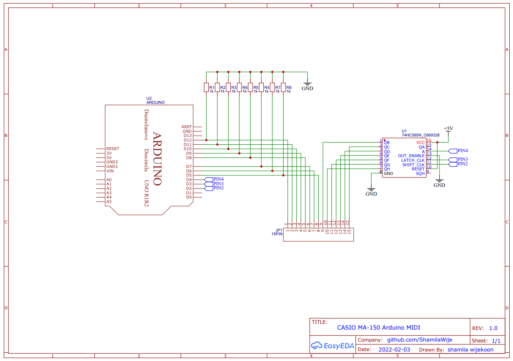
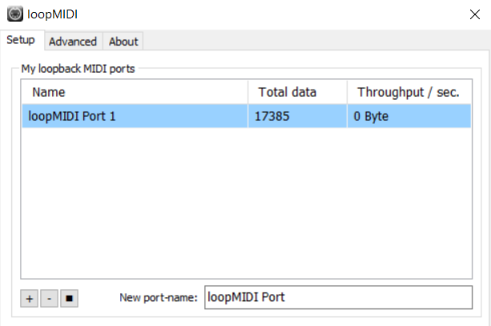

# Arduino USB MIDI CASIO MA-150
Converting CASIO MA-150 as a USB MIDI Input using Arduino uno

Use 74HC595 shift register with arduino uno to accommodate 15 pins from casio MA-150 keyboard output.
Typically we have to use diodes to prevent Ghosting
(https://www.dribin.org/dave/keyboard/one_html/)

But in this case you don't have to use diodes becouse keybord PCB already include with diodes.

After you connect everything according to this schematics upload the code to arduino,

Use this software to creat a MIDI port in windows
https://www.tobias-erichsen.de/software/loopmidi.html

Then use this software to connect arduino port to MIDI port
https://projectgus.github.io/hairless-midiserial/

Now enjoy your new USB MIDI keybord...
